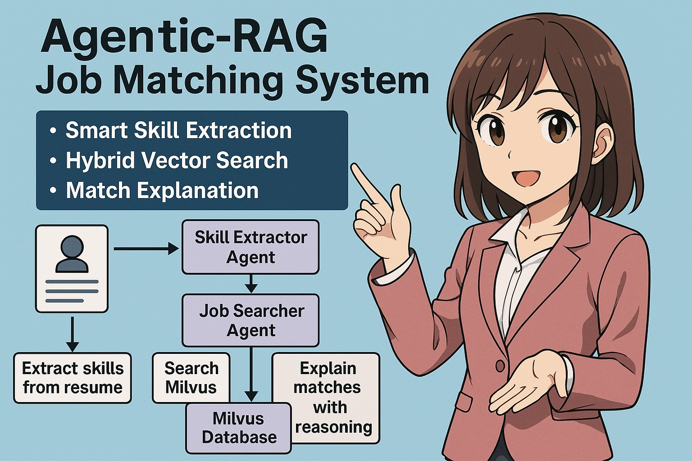
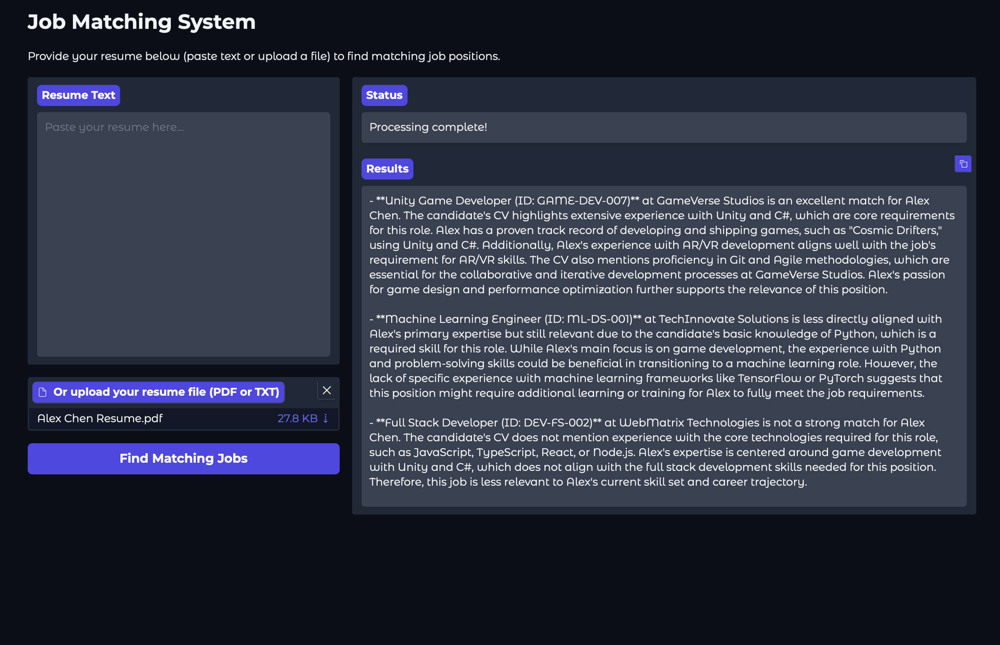

# Agentic-RAG Job Matching System

A sophisticated job matching system that combines **Retrieval Augmented Generation (RAG)** with an **agentic workflow** to match candidate resumes with suitable job positions. The system uses vector embeddings to find relevant job matches and provides detailed explanations of why each position is a good fit.

<p align="center">
  
</p>

## 📋 Features

- **Smart Skill Extraction**: Automatically identifies key skills from candidate resumes
- **Hybrid Vector Search**: Combines dense and sparse vector search for more accurate job matching
- **Match Explanation**: Provides detailed reasoning for why specific jobs match a candidate's profile
- **User-Friendly Interface**: Simple web UI for uploading resumes and viewing results
- **PDF and Text Support**: Process resumes in various formats
- **Persistence**: Save matching results for future reference

## ▶️ Quick Demo

<div align="center">
  <a href="https://github.com/yourusername/agentic-rag/raw/main/media/demo.mov">
    
    <br>
  </a>
</div>

## 🏗️ System Architecture

The system is built on a multi-agent architecture using the CrewAI framework. Think of it as a team of specialized experts working together:

```
┌─────────────────┐     ┌─────────────────┐     ┌─────────────────┐
│                 │     │                 │     │                 │
│  Skill Extractor├────►│  Job Searcher   ├────►│ Match Explainer │
│     Agent       │     │     Agent       │     │     Agent       │
│                 │     │                 │     │                 │
└─────────────────┘     └─────────────────┘     └─────────────────┘
        │                       │                       │
        ▼                       ▼                       ▼
┌─────────────────┐     ┌─────────────────┐     ┌─────────────────┐
│                 │     │                 │     │                 │
│  Extract skills │     │ Search Milvus   │     │ Explain matches │
│    from resume  │     │ vector database │     │ with reasoning  │
│                 │     │                 │     │                 │
└─────────────────┘     └─────────────────┘     └─────────────────┘
                              │
                              ▼
                        ┌─────────────────┐
                        │                 │
                        │  Milvus Vector  │
                        │    Database     │
                        │                 │
                        └─────────────────┘
```

### How It Works

1. **Resume Processing**:
   - The system extracts text from a resume (PDF or text)
   - A specialized LLM agent identifies 5-10 key skills

2. **Vector Search**:
   - Skills are used to perform a hybrid search in Milvus
   - Combines dense semantic embeddings (E5-large) with sparse BM25 matching
   - Retrieves the most relevant job positions based on similarity

3. **Match Explanation**:
   - Another LLM agent analyzes the matches and resume
   - Generates human-readable explanations of why each job is a good fit
   - Highlights specific skills and experiences that match job requirements

This architecture follows a domain-driven design approach where each agent has a clearly defined role and responsibility, communicating through well-defined interfaces.

## 🚀 Installation

### Prerequisites

- Python 3.11 or higher
- Docker (for running Milvus)
- OpenAI API key

### Setup

1. **Clone the repository**:
   ```bash
   git clone https://github.com/yourusername/agentic-rag.git
   cd agentic-rag
   ```

2. **Create a virtual environment**:
   ```bash
   python -m venv venv
   source venv/bin/activate  # On Windows: venv\Scripts\activate
   ```

3. **Install dependencies**:
   ```bash
   pip install -r requirements.txt
   ```

4. **Start Milvus with Docker**:
   ```bash
   docker run -d --name milvus-standalone -p 19530:19530 -p 9091:9091 milvusdb/milvus:v2.3.3 standalone
   ```

5. **Configure environment variables**:
   Create a `.env` file in the project root with:
   ```
   OPENAI_API_KEY=your_openai_api_key
   MILVUS_COLLECTION=job_positions
   TOP_K=3
   LOG_MISC=DEBUG
   ```

6. **Initialize the job database**:
   ```bash
   python job_positions_ingestion.py
   ```

## 📊 Usage

### Running the Web Interface

Start the Gradio web application:
```bash
python gradio_app.py
```

Then open your browser to `http://localhost:7860` (or the URL shown in the terminal).

### Using the Web Interface

1. **Upload a resume**: Either paste the text or upload a PDF/text file
2. **Start the matching process**: Click "Find Matching Jobs"
3. **View results**: The system will display matching jobs with explanations
4. **Save results**: Click "Save Results to Markdown" to persist the results

### Command-Line Usage

For batch processing or testing, you can use the command-line interface:
```bash
python main.py sample_resumes/Alex_Chen_Resume.md
```

## 📁 Project Structure

```
agentic-rag/
├── media/                    # Screenshot and demo files
├── results/                  # Output files from job matching
├── sample_resumes/           # Example resumes for testing
├── .gitignore                # Git ignore file
├── gradio_app.py             # Web interface using Gradio
├── job_positions_ingestion.py # Script to load job data into Milvus
├── job_positions.json        # Sample job position data
├── Logger.py                 # Logging utility
├── main.py                   # Core job matching logic with CrewAI
├── MilvusClient.py           # Interface to Milvus vector database
├── sandbox.ipynb             # Jupyter notebook for experimentation
└── Singleton.py              # Singleton pattern implementation
```

## 🔧 Technologies Used

- **[CrewAI](https://github.com/joaomdmoura/crewAI)**: Framework for creating and orchestrating AI agents
- **[Milvus](https://milvus.io/)**: Vector database for efficient similarity search
- **[Gradio](https://gradio.app/)**: Web interface for user interaction
- **[OpenAI API](https://openai.com/api/)**: Powers the language understanding capabilities
- **[PyMuPDF](https://pymupdf.readthedocs.io/)**: PDF processing library
- **[E5-large](https://huggingface.co/intfloat/e5-large-v2)**: Text embedding model for dense vector search

## 💡 How to Extend the System

### Adding New Job Positions

1. Add your job positions to `job_positions.json` following the existing format:
   ```json
   {
     "job_id": "YOUR-ID-001",
     "title": "Your Job Title",
     "company_name": "Your Company",
     "location": "Location (Remote/Hybrid/On-site)",
     "job_type": "Full-time/Part-time",
     "salary_range": "$XX,XXX - $YY,YYY",
     "required_skills": "Comma-separated list of skills",
     "text": "Detailed job description..."
   }
   ```

2. Run the ingestion script to update the database:
   ```bash
   python job_positions_ingestion.py
   ```

### Customizing the Matching Logic

The main agent workflow is defined in `main.py`. You can modify:

- The number of results returned by changing `TOP_K` in the `.env` file
- The weighting between dense and sparse search by updating the weights in the `MilvusJobSearchTool`
- The agent prompts and task descriptions to emphasize different aspects of matching

### Working with Custom Vector Embeddings

By default, the system uses the E5-large embeddings model. To use a different model:

1. Update the `embeddings` initialization in `MilvusClient.py`
2. Adjust the vector dimensions in the schema creation if needed

## 🔮 Future Improvements

- Add user authentication for saving personalized results
- Implement feedback mechanisms to improve matching quality
- Support for job posting scraping from popular job sites
- Advanced filtering options (location, salary range, etc.)
- Candidate skills gap analysis with suggestions for improvement

## 📄 License

This project is licensed under the MIT License - see the LICENSE file for details.

---

## 🧩 Conceptual Foundations

To understand this system, consider these key analogies:

1. **Vector Embeddings**: Think of skills as points in a high-dimensional space. Similar skills cluster together, while different skills are far apart. This allows us to find job positions "nearby" in this conceptual space.

2. **Hybrid Search**: Like using both a map (sparse/keyword matching) and a compass (dense/semantic direction) to navigate. The combination gives more accurate results than either method alone.

3. **Agent Workflow**: Similar to an assembly line in a factory, where each specialized worker performs their specific task and passes the result to the next worker.

By combining these powerful concepts, we create a system that understands both the explicit and implicit connections between candidate skills and job requirements.